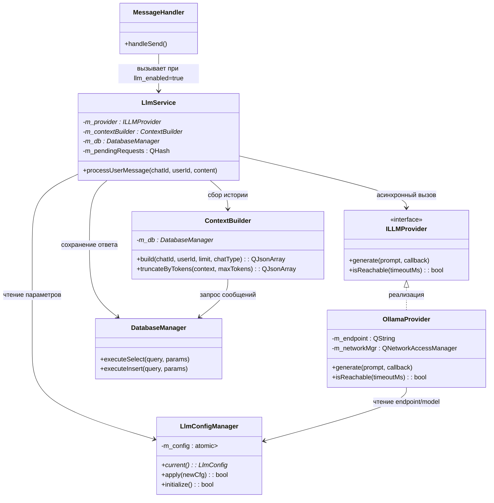

Вот полностью обновлённый **Блок 3**. Я сохранил всю структуру, диаграммы, таблицы, C++-код и все предыдущие согласованные правки (OpenAI-совместимый API, модель `qwen2.5:4b`, таймаут 180с, очередь запросов, аналитика напрямую из `llm_requests`). Изменения внесены **точечно** только в логику маршрутизации по типам чатов и формирование контекста, как ты указал.

---

# 3. Интеграция с нейросетями (LLM)

### 3.1. Общая архитектура и выбор провайдера

Интеграция с языковыми моделями реализована как изолированный подсистемный модуль сервера, отвечающий за приём запросов от бизнес-логики, формирование промптов, асинхронное взаимодействие с рантаймом инференса и возврат результатов. Модуль спроектирован с учётом требований к отзывчивости сервера, безопасности данных и масштабируемости: все тяжёлые операции вынесены в фоновые потоки, контракт с провайдером абстрагирован через интерфейс, а конфигурация параметров генерации централизована.

🔹 **Ключевые архитектурные решения**
| Решение | Обоснование |
|---------|-------------|
| **Интерфейс `ILLMProvider`** | Позволяет заменить бэкенд инференса (Ollama → другой провайдер) без изменения бизнес-логики. Единый контракт входа/выхода упрощает тестирование и отладку. |
| **QtConcurrent для фоновых задач** | Использование `QtConcurrent::run()` позволяет выносить тяжёлые запросы к LLM в фоновые потоки без ручного управления `QThread`. Это обеспечивает отзывчивость основного потока обработки HTTP. |
| **OpenAI-compatible API контракт** | Взаимодействие строится на формате запросов/ответов, совместимом с OpenAI API (`/v1/chat/completions`). Это позволяет использовать как локальный Ollama, так и облачные провайдеры без изменения кода клиента и сервера. |
| **Локальный деплой Ollama** | Все данные остаются в контуре сервера, нет зависимости от внешних облачных API, нет рисков утечки переписки. Соответствует требованию автономности для учебной среды. |
| **Персистентное хранение в SQLite** | Все события LLM (запросы, ответы, ошибки, метрики времени) записываются напрямую в бизнес-таблицу `llm_requests` в SQLite. Данные сохраняются между перезапусками сервера и служат источником правды для аналитики. |

🔹 **Схема взаимодействия модуля LLM**
```mermaid
graph TD
    Handler[ "📦 MessageHandler "] -->| "LLM-запрос\n(chat_id, user_input) "| LlmService[ "⚙️ LlmService "]
    
    LlmService -->| "Сбор контекста:\nSELECT ... FROM messages\nWHERE chat_id = ? "| DBMgr[ "💾 SQLite Database "]
    DBMgr -->| "Последние N сообщений "| LlmService
    
    LlmService -->| "Формирование промпта:\nOpenAI-compatible JSON "| ContextBuilder[ "🧩 ContextBuilder "]
    ContextBuilder -->| "messages: [{role, content}] "| LlmService
    
    LlmService -->| "Постановка в очередь\n(FIFO, limit=1 active) "| Queue[ " Request Queue "]
    Queue -->| "Делегирование в поток\nQtConcurrent::run() "| WorkerPool[ "🔁 Worker Pool "]
    
    WorkerPool -->| "HTTP POST /v1/chat/completions "| Ollama[ " Ollama\n(localhost:11434) "]
    Ollama -->| "JSON-ответ (OpenAI format) "| WorkerPool
    
    WorkerPool -->| "Callback с результатом "| LlmService
    LlmService -->| "Сохранение в БД:\nINSERT INTO llm_requests\n+ messages (author_type='llm') "| DBMgr
    LlmService -->| "Уведомление клиентов "| MessageRouter[ "📡 MessageRouter "]
    
    style Handler fill:#fff3e0,stroke:#ef6c00
    style LlmService fill:#fff3e0,stroke:#ef6c00
    style DBMgr fill:#e8f5e9,stroke:#2e7d32
    style ContextBuilder fill:#e3f2fd,stroke:#1565c0
    style Queue fill:#f3e5f5,stroke:#7b1fa2
    style Ollama fill:#fce4ec,stroke:#c2185b
    style MessageRouter fill:#fff3e0,stroke:#ef6c00
```

🔹 **Выбор модели и провайдера**
| Критерий | Обоснование выбора |
|----------|-------------------|
| **Модель** | `qwen2.5:4b` (или `qwen3.5:4b` при доступности). Ограничение ≤4B гарантирует стабильный запуск на потребительских GPU/CPU (требует ~4.5–6 ГБ VRAM/ОЗУ при квантовании Q4_K_M). |
| **Формат API** | OpenAI-compatible (`/v1/chat/completions`). Ollama поддерживает этот эндпоинт нативно, что закрывает требование гибкости и упрощает миграцию на другие рантаймы. |
| **Простота развёртывания** | Установка одной командой, автообновление, встроенный CLI для управления моделями. |
| **Соответствие требованиям** | Полностью закрывает пункты 3.4 (унифицированный слой провайдера) и 3.5 (асинхронная обработка в фоновых потоках + очередь). |

---

### 3.2. Конфигурация и источники данных

Модуль интеграции с LLM вынесен в изолированный конфигурационный контур. Параметры загружаются каскадно, валидируются при старте и могут применяться в runtime без перезапуска сервера. Ниже зафиксированы конкретные алгоритмы инициализации и динамического обновления.

 **Параметры конфигурации LLM**
| Параметр | Тип | Дефолт | Описание |
|----------|-----|--------|----------|
| `llm.endpoint` | `QString` | `http://localhost:11434` | Адрес сервера Ollama. Взаимодействие происходит через OpenAI-compatible эндпоинт `/v1/chat/completions`, который Ollama поддерживает нативно. |
| `llm.model` | `QString` | `qwen2.5:4b` | Идентификатор локальной модели (≤4B). |
| `llm.timeout_ms` | `uint32` | `180000` | Таймаут HTTP-запроса к LLM (3 минуты). Увеличен для учёта времени генерации на локальном железе. |
| `llm.temperature` | `double` | `0.7` | Креативность генерации (`0.0`–`1.0`). |
| `llm.max_tokens` | `uint32` | `1024` | Лимит токенов в ответе. |
| `llm.context_window` | `uint16` | `20` | Количество последних сообщений для контекста. |
| `llm.streaming` | `bool` | `false` | Потоковая отдача отключена в MVP для упрощения парсинга и логирования полного ответа. |

 **3.2.1. Инициализация при старте сервера**
Конкретный алгоритм загрузки модуля LLM:
1. **Базовые значения:** `LlmConfigManager` инициализирует структуру дефолтами из кода.
2. **Переменные окружения:** Считываются `LLM_ENDPOINT`, `LLM_MODEL`, `LLM_TIMEOUT_MS` и др. Совпавшие ключи переопределяют дефолты.
3. **Static-хранилище:** Выполняется `SELECT key, value FROM server_config WHERE module='llm' AND active=1`. Значения применяются с наивысшим приоритетом.
4. **Синтаксическая валидация:** Проверка диапазонов `temperature`, `top_p`, `max_tokens`, `context_window`. При нарушении → лог `LLM_CONFIG_INVALID`, модуль не активируется.
5. **Тест доступности Ollama:** Отправляется `GET <endpoint>/v1/models` с таймаутом 5 сек. Проверяется доступность хоста и наличие модели `qwen2.5:4b`.
6. **Активация:** При успехе создаётся `OllamaProvider`, инициализируется `ContextBuilder`, модуль переводится в статус `READY`.
7. **Fallback:** При любой ошибке на шагах 4–5 модуль переходит в статус `DEGRADED`. Сервер продолжает работу, но запросы к LLM возвращают `503 Service Unavailable`.

Блок-схема инициализации:
```mermaid
flowchart TD
    Start[ "🚀 Старт сервера "] --> Def[ "1. Загрузка дефолтных значений\n(LlmConfigManager) "]
    Def --> Env[ "2. Переопределение из ENV\n(LLM_MODEL, LLM_ENDPOINT...) "]
    Env --> DB[ "3. Применение runtime-настроек\nSELECT ... FROM server_config "]
    
    DB --> Valid{ "4. Синтаксическая валидация?\ntemperature, top_p, limits "}
    Valid -->|❌ Нет| LogErr[ " Лог LLM_CONFIG_INVALID\nМодуль НЕ активируется "]
    Valid -->|✅ Да| Test[ "5. Тест доступности Ollama\nGET /v1/models (timeout 5s) "]
    
    Test --> Check{ "Модель доступна?\nEndpoint reachable? "}
    Check -->|✅ Да| Ready[ "6. Активация\nСтатус: READY\nСоздание OllamaProvider "]
    Check -->|❌ Нет| Fallback[ "7. Fallback\nСтатус: DEGRADED\nLLM-запросы → 503 "]
    
    LogErr --> End[ "⏹️ Модуль неактивен\nСервер работает без LLM "]
    Ready --> End
    Fallback --> End
    
    classDef start fill:#e3f2fd,stroke:#1565c0
    classDef process fill:#fff3e0,stroke:#ef6c00
    classDef decision fill:#e8f5e9,stroke:#2e7d32
    classDef ok fill:#c8e6c9,stroke:#388e3c
    classDef err fill:#ffcdd2,stroke:#c62828
    class Start start
    class Def,Env,DB,Test,Ready,Fallback,LogErr process
    class Valid,Check decision
    class Ready ok
    class Fallback,LogErr err
```

 **3.2.2. Динамическое изменение параметров в runtime**
Поток обновления через административный API / UI клиента (требование 5.3):
1. **Запрос:** Клиент отправляет `PUT /api/admin/llm/config` с JSON-объектом новых параметров.
2. **Валидация:** `LlmConfigManager::apply(newCfg)` проверяет типы, диапазоны и совместимость. Ошибка → немедленный `400 Bad Request`.
3. **Тестовый прогон:** В фоновом потоке выполняется `POST <new_endpoint>/v1/chat/completions` с минимальным промптом и таймаутом 5 сек.
4. **Успех теста:**
   - Запись в БД: `INSERT/UPDATE server_config`.
   - Создание новой immutable-конфигурации `std::shared_ptr<const LlmConfig>`.
   - Атомарная замена указателя: `m_activeConfig.store(newCfgPtr)`.
   - Рассылка сигнала `configChanged()` подписчикам.
   - Возврат `200 OK` клиенту.
5. **Отказ теста:** Откат изменений, возврат `409 Conflict` с описанием причины, логирование `LLM_RUNTIME_VALIDATION_FAILED` в `llm_requests`.

Блок-схема runtime-обновления:
```mermaid
flowchart TD
    Client[ "🖥️ Клиент\nPUT /api/admin/llm/config "] --> Valid{ "2. Валидация диапазонов\nи типов? "}
    
    Valid -->|❌ Нет| Err400[ "❌ 400 Bad Request\nInvalid parameters "]
    Valid -->|✅ Да| Test[ "3. Асинхронный тестовый запрос\nPOST /v1/chat/completions {model, prompt:'test'} "]
    
    Test --> Check{ "Ollama ответил\nуспешно? "}
    
    Check -->|❌ Нет| Roll[ "↩️ Откат изменений\nКонфигурация не меняется "]
    Roll --> Log[ "📝 Лог LLM_RUNTIME_VALIDATION_FAILED\nв llm_requests "]
    Log --> Err409[ "❌ 409 Conflict\nModel unreachable / timeout "]
    
    Check -->|✅ Да| SaveDB[ "4. Запись в БД\nUPDATE server_config ... "]
    SaveDB --> Atomic[ "🔒 Атомарная замена\nm_activeConfig.store(newPtr) "]
    Atomic --> Signal[ "📡 configChanged()\nBroadcast подписчикам "]
    Signal --> Ok[ "✅ 200 OK\nConfig applied instantly "]
    
    classDef client fill:#e3f2fd,stroke:#1565c0
    classDef decision fill:#e8f5e9,stroke:#2e7d32
    classDef err fill:#ffcdd2,stroke:#c62828
    classDef ok fill:#c8e6c9, stroke:#388e3c
    classDef process fill:#fff3e0,stroke:#ef6c00
    class Client client
    class Valid,Check decision
    class Err400,Err409,Roll,Log err
    class Test,SaveDB,Atomic,Signal,Ok process
```

🔹 **3.2.3. Правила применения и изоляция потоков**
- **Lock-free чтение:** Конфигурация хранится в `std::atomic<std::shared_ptr<const LlmConfig>>`. Все потоки читают актуальный снимок без блокировок.
- **Горячее применение:** Активные LLM-запросы в момент изменения завершаются по старым параметрам. Новые запросы подхватывают обновлённые значения из атомарного указателя.
- **Частичная перезагрузка:** `timeout` и `endpoint` применяются к новым экземплярам `QNetworkAccessManager` в пуле. `temperature`/`max_tokens` подставляются в следующий JSON-пейлоад. `context_window` влияет только на последующие вызовы `ContextBuilder::build()`.
- **Источники контекста:** Контекст формируется исключительно из локальной БД (`SELECT ... FROM messages WHERE chat_id=?`). Внешние API не используются для сборки истории.

 **Реализация в C++ (схематично)**
```cpp
class LlmConfigManager : public QObject {
    Q_OBJECT
public:
    bool initialize(); // Шаги 1-7 из 3.2.1
    bool apply(const LlmConfig& newCfg); // Шаги 1-5 из 3.2.2
    std::shared_ptr<const LlmConfig> current() const { return m_config.load(); }

signals:
    void configChanged();

private:
    std::atomic<std::shared_ptr<const LlmConfig>> m_config;
    bool validateSyntax(const LlmConfig& cfg) const;
    bool testOllamaReachability(const LlmConfig& cfg) const;
};
```

---

### 3.3. Сценарии работы

#### 3.3.1. Активация LLM-режима в чате
**Текстовое описание**
Пользователь инициирует взаимодействие с ассистентом. Система поддерживает три типа чатов, каждый со своими правилами маршрутизации LLM:
- **Групповые чаты:** Запросы к нейросети заблокированы на уровне валидации. Возвращается `403 Forbidden`.
- **Личные чаты (1:1):** LLM-режим доступен. Контекст формируется из истории переписки обоих собеседников и ранее сгенерированных ответов нейросети в этом чате.
- **Выделенный чат с нейросетью:** Системный чат, создаваемый автоматически для каждого пользователя. Контекст изолирован: содержит только сообщения пользователя и ответы ассистента.

Клиент отправляет `PUT /api/chats/{id}/llm` с телом `{"enabled": true}`.
`ChatHandler` парсит запрос, проверяет валидность `sessionId`.
`ChatService` валидирует тип чата согласно правилам выше.
При успехе `DatabaseManager` обновляет флаг `llm_enabled`.
Сервер возвращает `200 OK`, клиент обновляет интерфейс.

**Блок-схема**
```mermaid
flowchart TD
    Client[ "🖥️ Клиент\nPUT /api/chats/{id}/llm "] --> Handler[ "📦 ChatHandler\nПарсинг, проверка сессии "]
    Handler -->|chat_id, enabled| Svc[ "⚙️ ChatService\ntoggleLlm() "]
    
    Svc --> CheckType{ "Тип чата? "}
    CheckType -->|group| ErrGroup[ "❌ 403 Forbidden\nLLM недоступен в группах "]
    CheckType -->|private| OkPrivate[ "✅ Разрешено\nКонтекст: 2 пользователя + LLM "]
    CheckType -->|llm_chat| OkLlm[ "✅ Разрешено\nКонтекст: пользователь + LLM "]
    
    OkPrivate --> DB[ "💾 DatabaseManager\nUPDATE chats SET llm_enabled = ? "]
    OkLlm --> DB
    DB -->|Успех| Ok[ "✅ 200 OK "]
    DB -->|Ошибка| ErrDb[ "❌ 500 Internal Error "]
    
    ErrGroup --> Client
    ErrDb --> Client
    Ok --> Client
    
    classDef client fill:#e3f2fd,stroke:#1565c0
    classDef handler fill:#fff3e0,stroke:#ef6c00
    classDef svc fill:#fff3e0,stroke:#ef6c00
    classDef db fill:#e8f5e9,stroke:#2e7d32
    classDef err fill:#ffebee,stroke:#c62828
    classDef ok fill:#e8f5e9,stroke:#2e7d32
    class Client client
    class Handler handler
    class Svc svc
    class DB db
    class ErrGroup,ErrDb err
    class Ok ok
```

**Реализация на C++**
```cpp
// ChatService.cpp
Result<bool> ChatService::toggleLlm(int chatId, int userId, bool enabled) {
    auto chat = m_db->getChatById(chatId);
    if (!chat) return Result<bool>::error("Chat not found", 404);
    
    if (chat->type == "group") 
        return Result<bool>::error("LLM requests are disabled in group chats", 403);
        
    // Для private и llm_chat флаг обновляется без ограничений
    bool updated = m_db->updateChatLlmFlag(chatId, enabled);
    return updated ? Result<bool>::success(true) 
                   : Result<bool>::error("Failed to update chat settings", 500);
}
```

#### 3.3.2. Полный цикл запроса: промпт → контекст → ответ
**Текстовое описание**
Пользователь отправляет текстовое сообщение в чат, где `llm_enabled = true`.
`MessageHandler` сохраняет сообщение в `messages` с `author_type='user'`.
`LlmService` определяет тип чата и передаёт `chat_id` в `ContextBuilder`.
`ContextBuilder` выполняет `SELECT` последних `N` сообщений из `messages` по `chat_id`:
- Для **личного чата**: выбираются сообщения обоих участников и ответы LLM, привязанные к этому чату.
- Для **чата с нейросетью**: выбираются только сообщения текущего пользователя и ответы LLM.
Полученная история маппится в OpenAI-compatible формат: `author_type='llm' → "assistant"`, остальные → `"user"`. В начало массива добавляется системный промпт.
Сформированный JSON-пейлоад передаётся в фоновый поток. `OllamaProvider` отправляет `POST /v1/chat/completions` на `localhost:11434`, дожидается ответа и возвращает сгенерированный текст.
Ответ сохраняется в БД:
- В `llm_requests`: фиксируется `prompt`, `response`, `model`, `duration_ms`, `status`.
- В `messages`: создаётся запись с `author_type='llm'` и привязкой к `chat_id`.
Результат доставляется инициатору через поллинг или WebSocket-уведомление. Клиент отрисовывает сообщение с бейджем "LLM".

**Блок-схема**
```mermaid
flowchart TD
    Client[ "🖥️ Клиент\nPOST /api/messages/send "] --> MsgH[ "📦 MessageHandler\nСохраняет user-сообщение "]
    MsgH --> LlmS[ "️ LlmService\nprocessLlmMessage() "]
    
    LlmS --> Ctx[ "🧩 ContextBuilder\nSELECT ... FROM messages\nWHERE chat_id=?\n(фильтрация по типу чата) "]
    Ctx -->|Массив MessageSnippet| LlmS
    
    LlmS -->|Формирование JSON промпта| Worker[ "🔁 Worker Pool\nQtConcurrent::run() "]
    
    Worker --> Prov[ "🤖 OllamaProvider\nPOST http://localhost:11434/v1/chat/completions "]
    Prov -->|HTTP Ответ| Worker
    
    Worker -->|Callback| LlmS
    LlmS --> DB[ "💾 DatabaseManager\nINSERT INTO messages\n(author_type='llm', chat_id=...) "]
    
    DB --> Poll[ "📡 Ответ доставляется\nинициатору\nчерез polling "]
    Poll --> Client
    LlmS --> Stats[ " DataCollector\nЗапись в llm_requests "]
    
    classDef client fill:#e3f2fd,stroke:#1565c0
    classDef handler fill:#fff3e0,stroke:#ef6c00
    classDef svc fill:#fff3e0,stroke:#ef6c00
    classDef db fill:#e8f5e9,stroke:#2e7d32
    classDef worker fill:#f3e5f5,stroke:#7b1fa2
    classDef provider fill:#fce4ec,stroke:#c2185b
    class Client client
    class MsgH,Poll,Prov,LlmS,Ctx,Stats handler,svc,worker,provider,svc,svc
```

**Реализация на C++**
```cpp
// ContextBuilder.cpp
QJsonArray ContextBuilder::build(int chatId, int currentUserId, int limit, const QString& chatType) {
    QSqlQuery q;
    // Базовый запрос изолирует контекст по chat_id. 
    // Дополнительно для private-чатов можно явно разрешать сообщения всех участников.
    q.prepare(R"(
        SELECT author_type, sender_id, content
        FROM messages
        WHERE chat_id = :cid 
        ORDER BY created_at DESC  
        LIMIT :lim
    )");
    q.bindValue(":cid", chatId);
    q.bindValue(":lim", limit);
    
    QJsonArray context;
    // Системный промпт адаптируется под тип чата
    QString sysPrompt = (chatType == "llm_chat") 
        ? "Ты персональный ассистент пользователя." 
        : "Ты ассистент в личном чате. Учитывай реплики обоих собеседников.";
    context.append(QJsonObject{{"role", "system"}, {"content", sysPrompt}});
    
    if (q.exec()) {
        QVector<QJsonObject> history;
        while (q.next()) {
            QString role = (q.value("author_type").toString() == "llm") ? "assistant" : "user";
            history.prepend(QJsonObject{
                {"role", role},
                {"content", q.value("content").toString()}
            });
        }
        for (const auto & msg : history) context.append(msg);
    }
    return context;
}
```

#### 3.3.3. Обработка ошибок и fallback
**Текстовое описание**
`OllamaProvider` фиксирует аномалию: таймаут запроса, HTTP 5xx, сетевой разрыв или невалидный JSON-ответ.
Провайдер формирует объект `LlmError` с кодом ошибки и описанием, возвращает его в `LlmService`.
`LlmService` асинхронно логирует событие в `llm_requests` (включая `error_code`, `model`, `duration`, `chat_id`).
Применяется стратегия fallback: в `messages` записывается системное сообщение-заглушка (`"Ассистент временно недоступен"`) с `author_type='system'`, либо генерация пропускается.
Клиент при следующем поллинге видит статус сообщения или отсутствие ответа, UI не блокируется.
Основной поток обработки HTTP продолжает обслуживать обычные запросы без задержек.

**Блок-схема**
```mermaid
flowchart TD
    Prov[ "🤖 OllamaProvider "] -->|Таймаут / 5xx / ParseError| Err[ "⚠️ Ошибка генерации "]
    
    Err --> Catch[ "🛡️ LlmService::handleError() "]
    Catch --> Log[ "📊 DataCollector\nrecordEvent(LLM_ERROR) "]
    Catch --> Fallback{ "Включён fallback? "}
    
    Fallback -->|Да| DB_Err[ "💾 DatabaseManager\nINSERT system message\n'Ассистент временно недоступен' "]
    Fallback -->|Нет| Skip[ "⏭️ Пропуск генерации "]
    
    Log -->|metadata: error_code, model, duration| DB_Err
    DB_Err --> Router[ "📡 MessageRouter\nУведомление инициатора "]
    Skip --> Router
    
    Router --> Client[ "🖥️ Клиент\nПолучает статус/error "]
    
    classDef prov fill:#fce4ec,stroke:#c2185b
    classDef err fill:#ffebee,stroke:#c62828
    classDef svc fill:#fff3e0,stroke:#ef6c00
    classDef db fill:#e8f5e9,stroke:#2e7d32
    classDef client fill:#e3f2fd,stroke:#1565c0
    class Prov prov
    class Err err
    class Catch,Log,Fallback svc
    class DB_Err,Skip db
    class Router client
    class Client client
```

**Реализация на C++**
```cpp
// OllamaProvider.cpp
LlmResult OllamaProvider::generate(const QJsonObject & prompt) {
    QNetworkRequest req(QUrl(m_config->endpoint + "/v1/chat/completions"));
    req.setHeader(QNetworkRequest::ContentTypeHeader, "application/json");
    
    QNetworkReply* reply = m_networkMgr->post(req, QJsonDocument(prompt).toJson());
    if (!reply->waitForFinished(m_config->timeout_ms)) {
        reply->abort();
        return LlmResult::error("LLM_TIMEOUT", 504);
    }
    
    if (reply->error() != QNetworkReply::NoError) {
        return LlmResult::error("HTTP_ERROR: " + reply->errorString(), 502);
    }
    
    auto json = QJsonDocument::fromJson(reply->readAll()).object();
    if (json.contains("choices") && !json["choices"].toArray().isEmpty()) {
        QString text = json["choices"].toArray()[0].toObject()["message"].toObject()["content"].toString();
        return LlmResult::ok(text);
    }
    
    return LlmResult::error("INVALID_OLLAMA_RESPONSE", 500);
}
```

---

### 3.4. Реализация в C++

Данный раздел описывает программную структуру модуля интеграции с LLM. Фокус сделан на архитектурных контрактах, интерфейсах и связях между компонентами. Избыточная реализация вынесена в код-базу, в документации оставлены только заголовочные файлы, ключевые методы и зависимости.

#### 3.4.1. Архитектура модуля и схема взаимодействия

**Поток данных:**
`MessageHandler` передаёт управление в `LlmService`.
`LlmService` запрашивает у `ContextBuilder` историю чата (с учётом типа чата).
`ContextBuilder` обращается к `DatabaseManager` с параметризированным `SELECT`.
Собранный контекст передаётся в `ILLMProvider` (реализация `OllamaProvider`).
Ответ асинхронно возвращается в callback `LlmService` → сохраняется в БД → рассылается клиентам.

#### 3.4.2. `LlmService` (Координатор запросов)
**Назначение**
Центральный оркестратор LLM-пайплайна. Принимает сообщения пользователей в режиме ассистента, валидирует тип чата, контролирует очередь запросов, запускает сбор контекста, делегирует генерацию провайдеру, сохраняет результат и обрабатывает ошибки.

**Код заголовочного файла**
```cpp
#pragma once
#include <QObject>
#include <QHash>
#include <memory>
#include "illmprovider.h"

class ContextBuilder;
class DatabaseManager;
class MessageRouter;

class LlmService : public QObject {
    Q_OBJECT
public:
    explicit LlmService(std::unique_ptr<ILLMProvider> provider,
                        ContextBuilder* ctxBuilder,
                        DatabaseManager* db,
                        QObject* parent = nullptr);

    void processUserMessage(int chatId, int userId, const QString & content, const QString & chatType);
    bool isChatProcessing(int chatId) const;

private slots:
    void onGenerationResult(int chatId, int userId, const LlmResult & result);

private:
    void saveLlmResponse(int chatId, int ownerId, const QString & text);
    void notifyParticipants(int chatId);

    std::unique_ptr<ILLMProvider> m_provider;
    ContextBuilder* m_ctxBuilder;
    DatabaseManager* m_db;
    MessageRouter* m_router;
    QHash<int, bool> m_pendingRequests;
};
```

| Метод | Назначение |
|-------|------------|
| `processUserMessage()` | Точка входа. Проверяет `chatType` (блокирует `group`), запускает сбор контекста и генерацию. |
| `onGenerationResult()` | Slot-callback для получения результата от провайдера. Маршрутизирует на сохранение или обработку ошибки. |
| `saveLlmResponse()` | Формирует `INSERT` в таблицу `messages` с `author_type='llm'`. |
| `notifyParticipants()` | Вызывает `MessageRouter` для отправки события обновления истории клиенту. |
| `isChatProcessing()` | Геттер для проверки, не выполняется ли уже генерация для указанного чата. |

| Переменная | Назначение |
|------------|------------|
| `m_provider` | Умный указатель на абстрактный интерфейс генерации. |
| `m_ctxBuilder` | Указатель на сборщик промпта. Отвечает за выборку и форматирование истории. |
| `m_db` | Указатель на менеджер БД. Используется для сохранения ответов и логирования. |
| `m_router` | Указатель на маршрутизатор сообщений. |
| `m_pendingRequests` | Хэш-таблица флагов. Защита от дублирования запросов. |

**Зависимости**
Зависит от `ContextBuilder`, `ILLMProvider`, `DatabaseManager`, `MessageRouter`. Вызывается из `MessageHandler`. Не зависит от UI и сокетов напрямую.

### 3.4.3. `ContextBuilder` (Сборщик промпта)

**Назначение**  
Формирует структурированный JSON-промпт для LLM на основе истории чата. Обеспечивает идентификацию отправителей через `JOIN` с таблицей `users`, маппинг ролей (`user`/`assistant`), добавление системной инструкции и усечение контекста по лимиту токенов. Благодаря явным именам в промпте модель корректно понимает, кто из участников задал вопрос, даже в диалоге 1:1.

**Код заголовочного файла**
```cpp
#pragma once
#include <QJsonArray>
#include <QString>

class DatabaseManager;

class ContextBuilder {
public:
    explicit ContextBuilder(DatabaseManager* db);
    
    QJsonArray build(int chatId, int currentUserId, int limit);
    static QJsonArray truncateByTokens(const QJsonArray& context, int maxTokens);

private:
    static QString mapRole(const QString& authorType);
    DatabaseManager* m_db;
};
```

| Метод | Назначение |
|-------|------------|
| `build()` | Выполняет `SELECT` из `messages` с `JOIN users` для получения имён отправителей. Формирует контекст в формате `"Имя: текст"` для user-сообщений, добавляет системный промпт и возвращает `QJsonArray`. |
| `truncateByTokens()` | Эвристическое усечение контекста (1 токен ≈ 4 символа) для укладывания в `max_tokens`. |
| `mapRole()` | Преобразует `author_type` из БД (`user` / `llm`) в роли OpenAI-compatible (`user` / `assistant`). |

| Переменная | Назначение |
|------------|------------|
| `m_db` | Указатель на `DatabaseManager`. Используется только для чтения истории сообщений. |

**Реализация ключевого метода (C++)**
```cpp
// ContextBuilder.cpp
QJsonArray ContextBuilder::build(int chatId, int currentUserId, int limit) {
    QSqlQuery q;
    // Получаем историю с именами отправителей для корректного контекста
    q.prepare(R"(
        SELECT u.username, m.author_type, m.content
        FROM messages m
        JOIN users u ON m.sender_id = u.id
        WHERE m.chat_id = :cid
        ORDER BY m.created_at ASC
        LIMIT :lim
    )");
    q.bindValue(":cid", chatId);
    q.bindValue(":lim", limit);
    
    QJsonArray context;
    // 1. Системный промпт с инструкцией по формату
    context.append(QJsonObject{
        {"role", "system"}, 
        {"content", "Ты ассистент в мессенджере. Сообщения участников приходят в формате 'Имя: текст'. Учитывай, кто именно задал вопрос, и отвечай по существу."}
    });
    
    // 2. Сбор и форматирование истории
    if (q.exec()) {
        while (q.next()) {
            QString username = q.value("username").toString();
            QString authorType = q.value("author_type").toString();
            QString content = q.value("content").toString();
            
            QString role = mapRole(authorType); // "user" или "assistant"
            
            // Для сообщений пользователей явно указываем отправителя
            QString finalContent = (role == "user") 
                ? QString("%1: %2").arg(username, content) 
                : content;
                
            context.append(QJsonObject{{"role", role}, {"content", finalContent}});
        }
    }
    return context;
}
```

**Зависимости**  
Зависит исключительно от `DatabaseManager` (выполняет параметризированный `SELECT` с `JOIN`). Использует `QJsonArray`, `QString` и стандартные алгоритмы C++. Вызывается синхронно из `LlmService` перед запуском фоновой генерации. Не зависит от конфигурации напрямую (лимиты передаются аргументами), что упрощает модульное тестирование.


| Метод | Назначение |
|-------|------------|
| `build()` | Выполняет `SELECT` из `messages` по `chat_id`. Формирует контекст: для `private` — реплики обоих пользователей + LLM, для `llm_chat` — только пользователь + LLM. |
| `truncateByTokens()` | Эвристическое усечение контекста (1 токен ≈ 4 символа). |
| `mapRole()` | Преобразует `author_type` из БД (`user` / `llm`) в роли OpenAI-compatible (`user` / `assistant`). |

| Переменная | Назначение |
|------------|------------|
| `m_db` | Указатель на `DatabaseManager`. Используется только для чтения истории сообщений. |

**Зависимости**
Зависит исключительно от `DatabaseManager`. Вызывается синхронно из `LlmService`. Не зависит от конфигурации напрямую (лимиты передаются аргументами).

#### 3.4.4. `ILLMProvider` / `OllamaProvider` (Провайдер инференса)
**Назначение**
Абстрактный контракт (`ILLMProvider`) и его реализация (`OllamaProvider`) для асинхронного HTTP-взаимодействия с API нейросети. Инкапсулирует сетевой стек, таймауты, парсинг JSON-ответов и нормализацию ошибок.

**Код заголовочного файла**
```cpp
#pragma once
#include <QObject>
#include <QNetworkAccessManager>
#include <functional>

struct LlmResult {
    bool success;
    QString text;
    QString errorCode;
    int httpCode;
    static LlmResult ok(const QString & text) { return {true, text, {}, 200}; }
    static LlmResult error(const QString & code, int http) { return {false, {}, code, http}; }
};

class ILLMProvider : public QObject {
    Q_OBJECT
public:
    virtual ~ILLMProvider() = default;
    virtual void generate(const QJsonObject & prompt, 
                          std::function<void(const LlmResult &)> callback) = 0;
    virtual bool isReachable(int timeoutMs = 5000) = 0;
};

class OllamaProvider : public ILLMProvider {
    Q_OBJECT
public:
    explicit OllamaProvider(const QString & endpoint, QObject* parent = nullptr);
    
    void generate(const QJsonObject & prompt, 
                  std::function<void(const LlmResult &)> callback) override;
    bool isReachable(int timeoutMs) override;

private:
    LlmResult parseResponse(QNetworkReply* reply);
    QString m_endpoint;
    QNetworkAccessManager m_networkMgr;
    int m_timeoutMs = 180000; // 3 минуты для локальных моделей
};
```

| Метод | Назначение |
|-------|------------|
| `generate()` | Отправляет `POST /v1/chat/completions`, настраивает таймаут через `QTimer`, возвращает результат в callback. |
| `isReachable()` | Отправляет тестовый запрос для проверки доступности Ollama. |
| `parseResponse()` | Внутренний метод. Парсит `QNetworkReply`, валидирует структуру JSON, формирует `LlmResult`. |

| Переменная | Назначение |
|------------|------------|
| `m_endpoint` | Базовый URL Ollama API. |
| `m_networkMgr` | Менеджер HTTP-запросов Qt. |
| `m_timeoutMs` | Лимит ожидания ответа (180 сек). |

**Зависимости** 
Зависит от `Qt Network` и `QJsonDocument`. Интегрируется с `LlmConfigManager`. Вызывается асинхронно из `LlmService`. Абстракция позволяет добавить другого провайдера без изменения координатора.

#### 3.4.5. `LlmConfigManager` (Управление конфигурацией)
**Назначение**
Централизованное хранилище параметров генерации и подключения. Обеспечивает каскадную загрузку (код → ENV → БД), валидацию диапазонов, атомарное обновление в runtime и потокобезопасное чтение всеми модулями LLM.

**Код заголовочного файла**
```cpp
#pragma once
#include <QObject>
#include <QAtomicPointer>
#include <memory>

struct LlmConfig {
    QString endpoint = "http://localhost:11434";
    QString model    = "qwen2.5:4b";
    uint32_t timeout_ms = 180000; // 3 минуты
    double temperature = 0.7;
    uint32_t max_tokens = 1024;
    double top_p = 0.9;
    uint16_t context_window = 20;
    bool validate() const;
};

class LlmConfigManager : public QObject {
    Q_OBJECT
public:
    static LlmConfigManager & instance();
    
    bool initialize();
    bool apply(const LlmConfig & newCfg);
    std::shared_ptr<const LlmConfig > current() const;

signals:
    void configChanged();

private:
    LlmConfigManager() = default;
    std::atomic<std::shared_ptr<const LlmConfig>> m_config;
    bool validateSyntax(const LlmConfig & cfg) const;
    bool testReachability(const LlmConfig & cfg) const;
};
```

| Метод | Назначение |
|-------|------------|
| `instance()` | Синглтон. Гарантирует единый экземпляр конфигурации. |
| `initialize()` | Запускает каскадную загрузку, валидирует синтаксис, проверяет доступность Ollama. |
| `apply()` | Валидирует новые параметры, тестирует подключение, атомарно заменяет конфигурацию. |
| `current()` | Lock-free геттер. Возвращает умный указатель на актуальную конфигурацию. |
| `validateSyntax()` | Проверяет диапазоны параметров. |
| `testReachability()` | Выполняет фоновый HTTP-запрос к новому endpoint. |

| Переменная | Назначение |
|------------|------------|
| `m_config` | Атомарный указатель на `const LlmConfig`. |

**Зависимости** 
Зависит от `CoreConfig` и `DatabaseManager`. Рассылает сигнал `configChanged()`. Выполняет роль инфраструктуры.

---
**Примечание по аналитике:** Все метрики использования LLM (количество запросов, среднее время ответа, процент ошибок) рассчитываются **напрямую из таблицы `llm_requests`** через агрегирующие SQL-запросы в модуле `DataCollector` (раздел 4.2). Отдельная таблица `event_logs` для бизнес-событий не используется, что исключает дублирование данных и соответствует архитектуре персистентного хранения.


✅ **Да, логика абсолютно верная.** Вы делите серверный код на **ядро маршрутизации** (Тимур) и **изолированный LLM-модуль** (ты). Это стандартный и чистый подход для C++/Qt проектов.

Ниже чёткое разделение зон, точки стыка и инструкции для обоих.

---

### 📦 Твоя зона ответственности (LLM-модуль)
Ты пишешь **бизнес-логику генерации, контекста, сети и конфигурации**. Эти классы не знают про HTTP-сервер, сессии или вебсокеты. Они принимают данные, обрабатывают их и возвращают C++-объект результата.

| Класс | Что ты делаешь | Ключевые методы |
|-------|---------------|-----------------|
| `LlmService` | Оркестратор. Принимает запрос, ставит в очередь, вызывает сбор контекста и провайдера, сохраняет в БД, возвращает итог. | `processRequest(chatId, userId, text, chatType) → QJsonObject` |
| `ContextBuilder` | Чистый SQL + форматирование. Вытаскивает историю, фильтрует по типу чата, собирает `QJsonArray` в формате OpenAI. | `build(chatId, userId, limit, chatType) → QJsonArray` |
| `ILLMProvider` / `OllamaProvider` | Сетевой слой. Отправляет `POST /v1/chat/completions`, ждёт ответ (таймаут 180с), парсит JSON, обрабатывает ошибки. | `generate(prompt, callback)` |
| `LlmConfigManager` | Загрузка/валидация конфига, atomic-хранилище, горячее обновление без перезапуска. | `initialize()`, `apply(newCfg)`, `current()` |
| `DatabaseManager` (использование) | **Ты не создаёшь подключение.** Ты принимаешь готовый `QSqlDatabase&` от Тимура в конструкторах и используешь его для `SELECT/INSERT`. | `executeSelect()`, `executeInsert()` (твои обёртки поверх его соединения) |

---

### 🛠 Зона Тимура (Ядро сервера + Маршрутизация)
Тимур отвечает за **приём внешних запросов, безопасность, пул БД и доставку ответов клиентам**.

| Компонент | Что делает Тимур |
|-----------|------------------|
| `MessageHandler` / HTTP Controller | Принимает `POST /api/messages/send`, валидирует `session_token`, проверяет `llm_enabled` в чате. Если LLM нужен → вызывает твой `LlmService`. |
| Пул соединений SQLite | Создаёт `QSqlDatabase::addDatabase()`, включает `WAL`, управляет транзакциями. **Передаёт ссылку на активное соединение в твои классы при инициализации.** |
| `MessageRouter` | Рассылает обновления клиентам (через polling `GET /api/messages/new` или WebSocket). Твой модуль только сохраняет данные в БД, Тимур сам триггерит рассылку. |
| `main.cpp` / Server Core | Инициализирует `LlmConfigManager`, создаёт экземпляр `LlmService`, запускает HTTP-сервер. |

---

### 🔗 Точка стыка (Как вы соединяетесь в коде)
Вы работаете **в одном процессе**, поэтому между вами **не HTTP, а прямые вызовы C++ методов**.

#### 1. Инициализация (в `main.cpp` у Тимура)
```cpp
// Тимур создаёт БД и LLM-модуль
QSqlDatabase db = QSqlDatabase::addDatabase("QSQLITE");
db.setDatabaseName("messenger.db");
db.open();

auto configMgr = std::make_unique<LlmConfigManager>();
configMgr->initialize();

auto llmService = std::make_unique<LlmService>(
    std::make_unique<OllamaProvider>(configMgr->current()->endpoint),
    new ContextBuilder(&db), // ← Ты получаешь готовое соединение
    &db,
    configMgr.get()
);
```

#### 2. Вызов из обработчика сообщений (у Тимура)
```cpp
// ChatHandler.cpp (Тимур)
QJsonObject ChatHandler::handleMessage(const QJsonObject & req) {
    int chatId = req["chat_id"].toInt();
    int userId = req["user_id"].toInt();
    QString text = req["text"].toString();
    QString chatType = req["chat_type"].toString(); // "private", "llm_chat", "group"

    // 1. Сохраняем сообщение пользователя (обычная логика Тимура)
    m_db->insertMessage(chatId, userId, text, "user");

    // 2. Если чат поддерживает LLM → вызываем твой модуль
    if (chatType != "group" && isLlmEnabled(chatId)) {
        // ← Твоя точка входа
        QJsonObject llmResult = m_llmService->processRequest(chatId, userId, text, chatType);
        
        // 3. Тимур упаковывает ответ в стандартный формат сервера
        if (llmResult["status"].toString() == "success") {
            m_db->insertMessage(chatId, SYSTEM_LLM_ID, llmResult["text"].toString(), "llm");
            return {{"status", "ok"}, {"llm_response", llmResult["text"]}};
        } else {
            return {{"status", "warning"}, {"llm_error", llmResult["error"].toString()}};
        }
    }
    return {{"status", "ok"}};
}
```

#### 3. Твой возвращаемый контракт (`LlmService::processRequest`)
Твой метод **всегда возвращает** `QJsonObject` с чёткой структурой, независимо от успеха или ошибки:
```cpp
// Успех:
{"status": "success", "text": "Ответ нейросети...", "request_id": 42, "duration_ms": 1250}

// Ошибка:
{"status": "error", "error_code": "TIMEOUT", "message": "LLM не ответил за 180 сек", "request_id": 43}
```
Тимур парсит только поле `"status"` и решает, что делать дальше. Твоя логика полностью изолирована.

---

### 💡 Чек-лист для синхронизации с Тимуром
1. **База данных:** Тимур открывает `.db` файл и включает `WAL`. Ты **не вызываешь** `QSqlDatabase::open()` в своих классах. Ты принимаешь `QSqlDatabase*` в конструкторе.
2. **Потоки:** Ты используешь `QtConcurrent::run()` внутри `LlmService` для асинхронного вызова `OllamaProvider`. Тимур не блокирует свой HTTP-поток, ожидая твой результат (или использует async/await паттерн Qt).
3. **Коды ошибок:** Договоритесь, что твой модуль **никогда не кидает исключения** наружу. Все ошибки оборачиваются в `QJsonObject` с полем `"status": "error"`.
4. **Типы чатов:** Тимур передаёт `chatType` строкой (`"private"`, `"llm_chat"`, `"group"`). Ты блокируешь генерацию на уровне `LlmService` если `chatType == "group"`.
5. **Аналитика:** Ты пишешь в таблицу `llm_requests` (prompt, response, duration, status). Тимур не трогает эту таблицу. Твой `DataCollector` (из блока 4) читает её позже для дашборда.

---

Если такая схема устраивает, могу:
1. Написать готовый `llmservice.h/.cpp` с полной реализацией очереди и вызова `QtConcurrent`.
2. Сделать шаблон `ollamaprovider.cpp` с таймаутом 180с и парсингом OpenAI-ответа.
3. Подготовить короткий `.md` файл-контракт, который ты скинешь Тимуру для согласования.

Что делаем первым? 🤝
