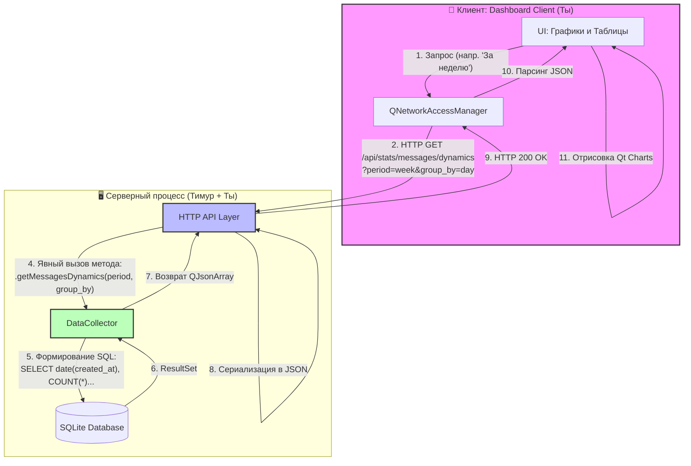

## 4. Модуль сбора и визуализации статистики

### 4.1 Общая архитектура модуля аналитики

**Что планируется реализовать:**

Модуль аналитики представляет собой трёхуровневую систему, состоящую из:
1. **DataCollector** — серверного класса для сбора и агрегации метрик из основных бизнес-таблиц (`messages`, `users`, `chats`, `llm_requests`)
2. **REST API endpoints** — набора HTTP-маршрутов для предоставления статистики клиентским приложениям
3. **Dashboard Client** — отдельного десктоп-приложения для администраторов с визуализацией данных через графики и таблицы

Ключевой принцип: статистические метрики рассчитываются **on-demand** (по запросу) напрямую из основных таблиц базы данных, без создания промежуточных таблиц агрегатов (`event_logs`, `daily_stats`, `aggregates_*`). Это устраняет дублирование данных, исключает риск рассинхронизации и гарантирует актуальность отчётов в любой момент времени.

---

**Собираемые метрики:**

| Категория | Метрика | Описание | Источник данных |
|-----------|---------|----------|----------------|
| **Пользователи** | `active_users_total` | Уникальные пользователи, отправившие ≥1 сообщение за период | `messages.sender_id` + `COUNT(DISTINCT)` |
| | `active_users_dynamics` | Динамика активных пользователей по интервалам (час/день/неделя) за период | `messages.created_at` + `GROUP BY` + `COUNT(DISTINCT sender_id)` |
| | `new_registrations` | Новые регистрации за период | `users.created_at` + `COUNT` |
| **Сообщения** | `messages_total` | Общее количество сообщений за период | `messages.id` + `COUNT` |
| | `messages_dynamics` | Динамика сообщений по интервалам (час/день/неделя) | `messages.created_at` + `GROUP BY` + `COUNT` |
| **LLM** | `llm_requests_total` | Количество запросов к нейросети за период | `llm_requests.id` + `COUNT` |
| | `llm_requests_dynamics` | Динамика запросов к LLM по интервалам (час/день/неделя) за период | `llm_requests.created_at` + `GROUP BY` + `COUNT` |
| | `llm_avg_response_ms` | Среднее время ответа LLM (мс) за период | `llm_requests.response_ms` + `AVG` |
| | `llm_error_rate` | Процент неудачных запросов к LLM | `llm_requests.status` + `COUNT(CASE WHEN error)` |

---

**Как планируется достигаться:**

**REST API Endpoints для аналитики:**

| Метод | Endpoint | Параметры | Описание | Пример ответа |
|-------|----------|-----------|----------|---------------|
| `GET` | `/api/stats/summary` | `period` (day/week/month) | Сводка: активные пользователи, сообщения, LLM-запросы за период | `{"active_users_total": 42, "messages_total": 1250, "llm_requests_total": 87}` |
| `GET` | `/api/stats/users/active` | `period`, `group_by` (hour/day/week) | Динамика активных пользователей | `[{"bucket":"2026-05-01","count":15}, ...]` |
| `GET` | `/api/stats/users/new` | `period` | Новые регистрации за период | `{"new_registrations": 8}` |
| `GET` | `/api/stats/messages/total` | `period` | Общее количество сообщений | `{"messages_total": 1250}` |
| `GET` | `/api/stats/messages/dynamics` | `period`, `group_by` | Динамика сообщений по интервалам | `[{"bucket":"2026-05-01","count":145}, ...]` |
| `GET` | `/api/stats/llm/total` | `period` | Количество LLM-запросов | `{"llm_requests_total": 87}` |
| `GET` | `/api/stats/llm/dynamics` | `period`, `group_by` | Динамика LLM-запросов | `[{"bucket":"2026-05-01","count":12}, ...]` |
| `GET` | `/api/stats/llm/performance` | `period` | Производительность LLM: среднее время, процент ошибок | `{"avg_response_ms": 1250, "error_rate": 0.03}` |

---

**Схема взаимодействия компонентов (Mermaid Flowchart):**



---

**Разделение ответственности (согласно схеме):**

1.  **Dashboard Client (Ты):**
    *   Отправляет запросы с параметрами (период, тип группировки).
    *   Парсит JSON-ответ.
    *   Отрисовывает графики (`Qt Charts`).
    *   *Не работает* с базой данных напрямую.

2.  **HTTP API Layer (Тимур):**
    *   Принимает HTTP-запрос.
    *   Извлекает и валидирует параметры из URL.
    *   **Вызывает конкретный метод** у `DataCollector` (например, `getMessagesDynamics`).
    *   Превращает результат (C++ объекты) обратно в JSON и отправляет клиенту.

3.  **DataCollector (Ты):**
    *   Получает чистые C++ аргументы (строки, числа, перечисления) от API Layer.
    *   Пишет и выполняет параметризованные SQL-запросы к SQLite.
    *   Возвращает готовые данные (`QJsonArray`, `QJsonObject`) обратно в API Layer.
    *   *Не знает* про HTTP-заголовки и коды ответов.


    ### 4.2 Серверный модуль сбора данных: DataCollector

**Что планируется реализовать:**

Серверный класс `DataCollector`, выступающий изолированным слоем работы с данными. Модуль отвечает исключительно за выполнение агрегирующих SQL-запросов к бизнес-таблицам (`messages`, `users`, `llm_requests`, `chats`) и возврат структурированных C++-объектов. 

Класс **не обрабатывает HTTP-запросы, не парсит URL и не формирует сетевые ответы**. Его зона ответственности ограничена преобразованием сырых данных из SQLite в готовые структуры `QJsonObject` и `QJsonArray`, которые затем передаются в HTTP API Layer для сериализации и отправки клиенту.

Расчет метрик выполняется **on-demand** (в момент вызова метода) напрямую из таблиц транзакций. Промежуточные таблицы (`event_logs`, `aggregates_*`) не используются, что исключает дублирование данных и необходимость фоновых задач агрегации.

**Как планируется достигаться:**

1. **Параметризация запросов:** Вместо написания десятков однотипных методов используется единый механизм динамической сборки SQL-запросов на основе перечислений `Period` (период выборки: день/неделя/месяц/год) и `Granularity` (детализация группировки: час/день/неделя).
2. **Агрегация в СУБД:** Вся тяжелая работа (фильтрация по датам, группировка, подсчет уникальных значений, вычисление средних) делегируется SQLite через операторы `WHERE`, `GROUP BY`, `COUNT(DISTINCT)`, `AVG`. Это обеспечивает выполнение сложных выборок за один проход по индексу.
3. **Возврат типов Qt:** Методы возвращают `QJsonObject` (для скалярных метрик) или `QJsonArray` (для временных рядов). HTTP-слой только оборачивает их в финальный ответ, что упрощает тестирование `DataCollector` без поднятия веб-сервера.
4. **Безопасность и производительность:** Все запросы параметризованы (`addBindValue`) для защиты от инъекций. Для ускорения `WHERE created_at >= ...` и `GROUP BY date(created_at)` в схеме БД предусмотрены составные индексы.

**Пример заголовочного файла (`datacollector.h`):**

```cpp
#ifndef DATACOLLECTOR_H
#define DATACOLLECTOR_H

#include <QObject>
#include <QSqlDatabase>
#include <QJsonObject>
#include <QJsonArray>
#include <QVariantList>

// Период выборки данных
enum class Period { DAY, WEEK, MONTH, YEAR };

// Детализация группировки временных рядов
enum class Granularity { HOUR, DAY, WEEK, MONTH };

class DataCollector : public QObject {
    Q_OBJECT

public:
    explicit DataCollector(QSqlDatabase db, QObject *parent = nullptr);

    // 1. Сводная статистика за период (скалярные значения)
    QJsonObject getSummary(Period period);

    // 2. Динамика активных пользователей (временной ряд)
    QJsonArray getActiveUsersDynamics(Period period, Granularity granularity);

    // 3. Динамика сообщений (временной ряд)
    QJsonArray getMessagesDynamics(Period period, Granularity granularity);

    // 4. Динамика LLM-запросов (временной ряд)
    QJsonArray getLLMRequestsDynamics(Period period, Granularity granularity);

    // 5. Производительность LLM (среднее время, % ошибок)
    QJsonObject getLLMPerformance(Period period);

private:
    QSqlDatabase db_; // Активное соединение с БД (из пула сервера)

    // Внутренние утилиты для сборки SQL
    QString buildWhereClause(Period period) const;
    QString buildGroupByExpression(Granularity granularity) const;
    
    // Универсальный исполнитель запросов
    QJsonArray executeTimeSeriesQuery(const QString &metricField, 
                                      const QString &groupByExpr, 
                                      const QString &whereClause) const;
};

#endif // DATACOLLECTOR_H
```

**Описание главных методов и переменных класса:**

| Компонент | Описание |
|-----------|----------|
| **Переменная `QSqlDatabase db_`** | Хранит ссылку на соединение с SQLite. Инициализируется при создании объекта (передаётся из пула соединений сервера). Гарантирует, что класс не создаёт собственные подключения, а использует инфраструктуру сервера. |
| **Метод `getSummary(period)`** | Выполняет 3–4 лёгких `SELECT COUNT/DISTINCT` запроса к таблицам `users`, `messages`, `llm_requests` за указанный период. Собирает результаты в единый `QJsonObject` (ключи: `active_users_total`, `messages_total`, `new_registrations` и т.д.). |
| **Метод `getActiveUsersDynamics(period, granularity)`** | Формирует запрос вида `SELECT strftime(..., created_at), COUNT(DISTINCT sender_id) FROM messages WHERE ... GROUP BY ...`. Возвращает `QJsonArray` вида `[{"bucket":"2026-05-01","count":12}, ...]` для отрисовки графика на клиенте. |
| **Метод `getMessagesDynamics(period, granularity)`** | Аналогичен предыдущему, но агрегирует `COUNT(id)` из таблицы `messages`. Позволяет строить графики нагрузки на чаты. |
| **Метод `getLLMRequestsDynamics(period, granularity)`** | Агрегирует данные из таблицы `llm_requests` по полю `created_at`. Используется для визуализации нагрузки на нейросетевой модуль. |
| **Метод `getLLMPerformance(period)`** | Вычисляет `AVG(response_ms)` и процент записей со статусом ошибки за период. Возвращает `QJsonObject` с полями `llm_avg_response_ms` и `llm_error_rate`. |
| **Утилиты `buildWhereClause` / `buildGroupByExpression`** | Преобразуют перечисления `Period` и `Granularity` в фрагменты SQL-синтаксиса (например, `"-7 days"` или `"date(created_at)"`). Централизуют логику формирования запросов, упрощая добавление новых метрик. |
| **Утилита `executeTimeSeriesQuery`** | Шаблонный метод-обёртка. Принимает готовое `WHERE` и `GROUP BY`, выполняет запрос через `QSqlQuery`, итерирует результат и собирает `QJsonArray`. Избавляет от дублирования кода парсинга `QSqlRecord`. |

**Принцип интеграции с HTTP API Layer:**
Методы вызываются синхронно из контроллеров сервера (например, `StatsController::getMessages()`). HTTP-слой отвечает только за извлечение параметров из URL, маппинг строк в `enum Period/Granularity`, вызов соответствующего метода `DataCollector` и оборачивание результата в HTTP-ответ с заголовком `application/json`. Такой подход обеспечивает строгое разделение ответственности: `DataCollector` знает только SQL и данные, сервер знает только протокол и маршруты.


### 4.3 Клиент аналитики: Dashboard Client

**Что планируется реализовать:**
Отдельное десктопное приложение на базе Qt Widgets и Qt Charts, предназначенное исключительно для администраторов системы. Приложение визуализирует метрики, собранные серверным модулем `DataCollector`, в виде интерактивных графиков и сводных таблиц. 
Клиент не имеет прямого доступа к базе данных SQLite; всё взаимодействие строится на асинхронных HTTP-запросах к REST API сервера в строгом соответствии с контрактами из раздела 4.1. Это обеспечивает безопасность данных, централизацию логики расчётов и возможность масштабирования серверной части без модификации клиентского кода.

#### 4.3.1 Сетевой слой
Сетевое взаимодействие реализуется через `QNetworkAccessManager`. Клиент отправляет только `GET`-запросы к эндпоинтам `/api/stats/*`. Запросы формируются асинхронно, что гарантирует отсутствие блокировок основного потока приложения (UI остаётся отзывчивым во время ожидания ответа). Каждый запрос содержит параметры периода (`period`) и детализации (`group_by`), извлекаемые из элементов управления UI. Ответы сервера принимаются в формате JSON, валидируются по HTTP-статусу (`200 OK`) и передаются в слой парсинга. При сетевых ошибках (`4xx`, `5xx`, таймауты) срабатывает механизм повторных попыток (retry) и вывод пользовательского уведомления. Таймаут запросов установлен в 30 секунд для предотвращения зависания интерфейса при недоступности сервера.

#### 4.3.2 Локальное кэширование и хранение настроек
Для снижения нагрузки на сервер и ускорения повторных обращений к одним и тем же данным реализуется механизм локального кэширования. Кэш хранится в отдельном файле SQLite (`dashboard_cache.db`), развёртываемом в директории приложения. В таблице `api_cache` сохраняются: ключ запроса (URL + параметры), JSON-тело ответа и метка времени (`created_at`). При обращении к метрике клиент сначала проверяет наличие записи в кэше с TTL (Time-To-Live) 10 минут. Если данные актуальны — они загружаются локально без сетевого запроса. Если кэш устарел или отсутствует — выполняется запрос к серверу, а ответ автоматически сохраняется в `api_cache`. В этом же локальном хранилище фиксируются пользовательские настройки: последний выбранный период, адрес сервера и состояние авторизации, что позволяет восстанавливать интерфейс при перезапуске приложения.

#### 4.3.3 Описание окон приложения

##### 4.3.3.1 Окно авторизации (`AuthWindow`)
**Назначение:** 
Проверка прав доступа администратора перед запуском основного модуля аналитики. Реализует упрощённую клиентскую проверку пароля без обращения к серверу.

**Описание окна:**
Модальное диалоговое окно фиксированного размера. По центру расположен заголовок «Вход в панель администратора». Ниже размещено поле ввода `QLineEdit` в режиме маскировки пароля (`EchoMode::Password`). Под полем находится кнопка «Войти» (`QPushButton`). При вводе неверного пароля под кнопкой появляется красная надпись `QLabel` с текстом «Неверный пароль». Окно не имеет системных кнопок сворачивания/разворачивания, доступна только кнопка закрытия.

**Связь с другими компонентами:**
При успешной проверке окно испускает сигнал `loginSuccessful()`, который ловит `main.cpp` или менеджер окон, закрывает `AuthWindow` и открывает `MainWindow`. При закрытии окна без ввода пароля приложение завершает работу.

**Реализация на C++:**
```cpp
class AuthWindow : public QDialog {
    Q_OBJECT
public:
    explicit AuthWindow(QWidget *parent = nullptr);
signals:
    void loginSuccessful();
private slots:
    void onLoginClicked();
private:
    QLineEdit *passwordInput;
    QLabel *errorLabel;
    QPushButton *loginBtn;
    // Константа проверки (в продакшене выносится в конфиг/сервер)
    static constexpr const char* ADMIN_PASSWORD = "admin1111";
};
// Логика слота: if (passwordInput->text() == ADMIN_PASSWORD) emit loginSuccessful(); else errorLabel->show();
```

##### 4.3.3.2 Главное окно аналитики (`MainWindow`)
**Назначение:** 
Основной интерфейс для визуализации метрик, управления параметрами выборки и взаимодействия с сервером. Предоставляет администратору единую точку контроля за активностью мессенджера и эффективностью LLM-модуля.

**Описание окна:**
Окно построено на базе `QMainWindow` с использованием `QSplitter` для изменения пропорций панелей.
- **Левая панель (25% ширины):** 
  - `QComboBox` «Метрика» (список: Активные пользователи, Сообщения, LLM-запросы, Производительность LLM).
  - `QComboBox` «Период» (День, Неделя, Месяц, Год).
  - `QComboBox` «Детализация» (Час, День, Неделя) — активно только для метрик динамики.
  - Кнопка «Обновить данные» (`QPushButton`).
  - Индикатор состояния сети (`QLabel` с иконкой).
- **Центральная область (75% ширины):** 
  - Контейнер `QWidget` с `QVBoxLayout`.
  - `QChartView` для отрисовки графиков (автоматически переключается между `QBarSeries`, `QLineSeries` в зависимости от метрики).
  - `QTableView` под графиком для табличного отображения сырых данных.
- **Нижняя панель:** `QStatusBar` для вывода статуса загрузки, ошибок сети и информации о последнем обновлении.

**Связь с другими компонентами:**
Окно напрямую взаимодействует с `QNetworkAccessManager` для отправки запросов к эндпоинтам `/api/stats/*`. Полученные JSON-массивы передаются в методы отрисовки графиков. Скалярные метрики (из `/api/stats/summary`) отображаются в виде информационных карточек над графиком. При смене параметров в `QComboBox` автоматически инициируется новый запрос к серверу.

**Реализация на C++:**
```cpp
class MainWindow : public QMainWindow {
    Q_OBJECT
public:
    explicit MainWindow(QWidget *parent = nullptr);
    ~MainWindow();
private slots:
    void onMetricChanged(int index);
    void onPeriodChanged(int index);
    void onRefreshClicked();
    void onNetworkReplyFinished(QNetworkReply *reply);
private:
    // UI
    QComboBox *metricBox, *periodBox, *granularityBox;
    QPushButton *refreshBtn;
    QChartView *chartView;
    QTableView *dataTable;
    QStatusBar *statusBar;
    
    // Сеть и данные
    QNetworkAccessManager *netManager;
    QJsonDocument currentData;
    
    // Логика
    void requestData();
    void renderChart(const QJsonArray &data);
    void updateTable(const QJsonArray &data);
    void showStatus(const QString &msg, bool isError = false);
};
// Метод requestData() формирует URL на основе выбранных комбобоксов, 
// добавляет заголовки, вызывает netManager->get(). 
// onNetworkReplyFinished парсит ответ, проверяет кэш, вызывает renderChart/updateTable.
```

